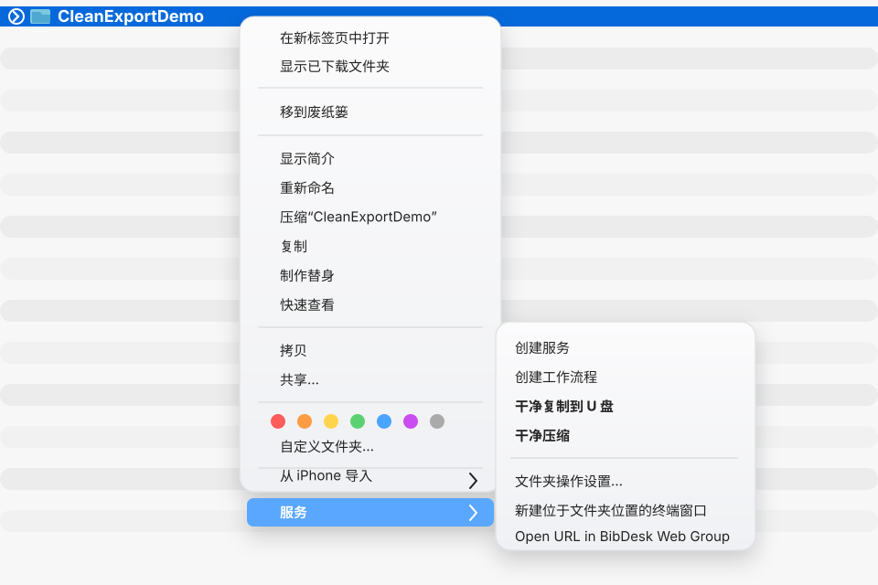

# macos-clean-export

Finder Quick Actions for clean macOS folder export.

It adds two right-click actions to Finder:

- `干净压缩`: create a clean zip next to the selected folder.
- `干净复制到U盘`: copy the selected folder to a USB drive or external destination.

The output excludes common macOS metadata artifacts:

- `.DS_Store`
- `._*` AppleDouble files
- `__MACOSX`

## Why This Exists

macOS stores Finder view state, resource forks, tags, quarantine flags, and other metadata in ways that are useful on macOS but noisy when sharing files with Windows, Linux, NAS devices, USB drives, or online submission systems.

Common examples include:

```text
.DS_Store
._filename
__MACOSX/
```

System settings such as `DSDontWriteNetworkStores` can reduce some `.DS_Store` behavior on network shares, but they do not fully solve clean zip creation or USB export. This project focuses on the export step: the original folder can stay unchanged, while the copied or zipped output is clean.

## Requirements

- macOS
- Finder
- Automator / Quick Actions support
- Built-in command line tools: `zsh`, `zip`, `zipinfo`, `rsync`, `osascript`, `plutil`

No Homebrew dependency is required.

## Install

Clone the repository:

```bash
git clone https://github.com/<your-account>/macos-clean-export.git
cd macos-clean-export
```

Replace `<your-account>` with the GitHub account or organization that owns the repository.

Run the installer:

```bash
zsh install.sh
```

The installer copies the command line scripts to:

```text
~/.local/bin/macos-clean-zip
~/.local/bin/macos-clean-copy-usb
```

It also creates Finder Quick Actions under:

```text
~/Library/Services/干净压缩.workflow
~/Library/Services/干净复制到U盘.workflow
```

If the actions do not appear immediately, restart Finder:

```bash
killall Finder
```

If they still do not appear, log out and log back in.

## Usage

### Clean Zip

1. In Finder, right-click a folder.
2. Choose `快速操作`.
3. Choose `干净压缩`.

A zip file is created next to the selected folder:

```text
FolderName_clean.zip
```

If that file already exists, a timestamp is appended to avoid overwriting it.

### Clean Copy To USB

1. In Finder, right-click a folder.
2. Choose `快速操作`.
3. Choose `干净复制到U盘`.
4. In the system folder picker, select the USB drive or destination folder.

The folder picker is intentional. On modern macOS, Quick Actions may be blocked from writing to removable volumes unless the user explicitly chooses the destination.

If the destination already contains a folder with the same name, the copy is written to a timestamped folder instead of overwriting the existing one.

## Preview

The preview below shows the installed Finder services on a demo folder. It uses a generic demo folder name and does not rely on any private local path.



## Command Line Usage

You can also use the scripts directly.

Create a clean zip:

```bash
~/.local/bin/macos-clean-zip /path/to/folder
```

Copy cleanly to a known destination:

```bash
CLEAN_COPY_TARGET=/Volumes/USB ~/.local/bin/macos-clean-copy-usb /path/to/folder
```

`CLEAN_COPY_TARGET` is mainly useful for testing and scripted use. The Finder Quick Action normally asks you to choose the destination folder.

## Verify The Output

Check a zip file:

```bash
zipinfo -1 FolderName_clean.zip | grep -E '(^|/)(__MACOSX(/|$)|\.DS_Store$|\._[^/]*$)'
```

No output means no matching macOS metadata artifacts were found.

Check a copied folder:

```bash
find /Volumes/USB/FolderName \( -name '.DS_Store' -o -name '._*' -o -name '__MACOSX' \) -print
```

No output means the copied folder is clean.

## Troubleshooting

### The Quick Actions Do Not Show Up

Restart Finder:

```bash
killall Finder
```

If that is not enough, log out and log back in.

You can also check that the workflow folders exist:

```bash
ls ~/Library/Services
```

### Clean Copy Reports "Operation Not Permitted"

Use the destination picker and select the USB drive or a folder inside it. This grants the Quick Action access to the selected location.

If macOS still blocks it, open:

```text
System Settings -> Privacy & Security
```

Then check `Files and Folders`, `Removable Volumes`, or `Full Disk Access` for Automator-related entries such as:

```text
Automator
Automator Workflow Runner
WorkflowServiceRunner
```

The exact name varies by macOS version.

### Finder Still Creates .DS_Store Locally

That is expected. This tool does not try to disable Finder's local behavior. It cleans the exported zip or copied folder.

The installer also sets these low-risk preferences:

```bash
defaults write com.apple.desktopservices DSDontWriteNetworkStores -bool TRUE
defaults write com.apple.desktopservices DSDontWriteUSBStores -bool TRUE
```

They can reduce `.DS_Store` creation on network shares and USB drives, but they do not replace the clean export actions.

## Uninstall

Run:

```bash
zsh uninstall.sh
```

This removes the installed scripts and Finder Quick Actions.

The uninstall script does not reset your `com.apple.desktopservices` preferences. To reset them manually:

```bash
defaults delete com.apple.desktopservices DSDontWriteNetworkStores 2>/dev/null || true
defaults delete com.apple.desktopservices DSDontWriteUSBStores 2>/dev/null || true
killall Finder
```

## What Gets Removed From Output

During zip creation or USB copy, these paths are excluded or deleted from the exported result:

```text
.DS_Store
._*
__MACOSX
```

The source folder is not modified.

## License

MIT
